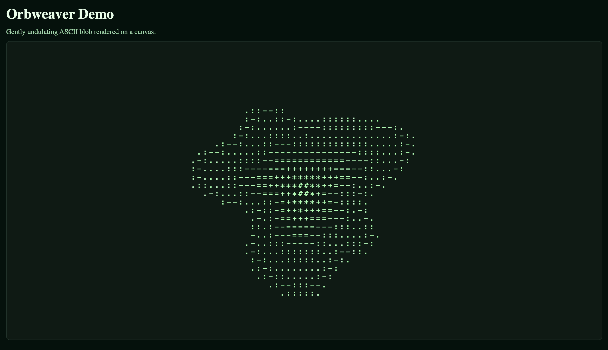

# Orbweaver



A library for rendering pleasing blob-like orbs as ascii or shaded hues.

It supports:

- Bring your own rendering backend (canvas, terminal ascii, etc)
- Customizable colors
- Responsive interaction (mouse, keyboard, audio, etc)

## Usage

```bash
# install the orbweaver package
pnpm add orbweaver-core
```

Render a blob in an HTML canvas:

```tsx
// index.ts
import { Orbweaver } from "orbweaver-core";

const orbweaver = new Orbweaver(
  document.getElementById("canvas") as HTMLCanvasElement,
  {
    cols: 100,
    rows: 36,
    foreground: "#A8FFB5",
    background: "#081B12",
  }
);

orbweaver.start();
```

```html
<!-- index.html -->
<canvas id="canvas" style="width: 100%; height: 100%; border-radius: 8px; border: 1px solid #1E3A2F; background: #081B12;"></canvas>
```

## Development

Install dependencies:

```bash
# ensure node v23 is installed, and pnpm v10.14
pnpm install
```

Start the development react app from the root of the monorepo:

```bash
pnpm dev
```
